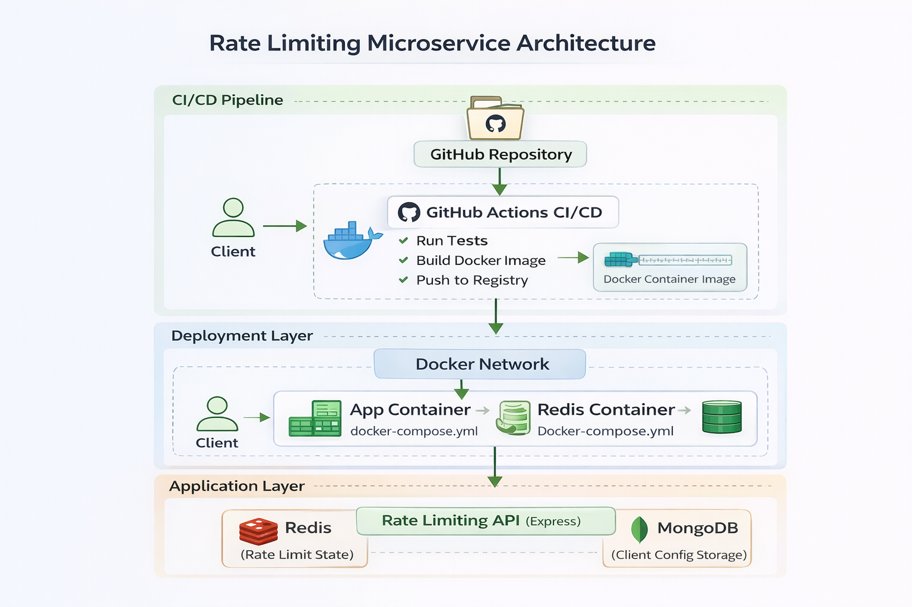

#  Rate Limiting Microservice

A production-ready API Rate Limiting Microservice built with **Node.js, Express, MongoDB, Redis, Docker, and GitHub Actions CI/CD**.

This service implements the **Token Bucket algorithm** and supports distributed rate limiting using Redis.

---

##  Features

-  Token Bucket rate limiting algorithm
-  Distributed rate limiting using Redis
-  MongoDB for client storage
-  API key hashing (bcrypt)
-  Docker multi-stage build
-  docker-compose orchestration
-  Health checks for all services
-  Automatic database seeding
-  Unit & Integration tests (Jest + Supertest)
-  GitHub Actions CI/CD
-  Swagger documentation
-  Structured logging
-  Environment variable configuration

---

## Architecture Diagram

<p align="center">
  
</p>

The service is stateless.  
All rate limit state is stored in Redis for horizontal scalability.

---

## Project Structure

```
rate-limit-service/
│
├── src/
│   ├── controllers/
│   ├── services/
│   ├── models/
│   ├── routes/
│   ├── config/
│   └── app.js
│
├── tests/
│   ├── unit/
│   └── integration/
│
├── .github/workflows/ci.yml
├── Dockerfile
├── docker-compose.yml
├── init-db.js
├── .env.example
├── package.json
└── README.md
```

---

## Environment Variables

Create `.env` file:

```
PORT=3000
DATABASE_URL=mongodb://mongo:27017/ratelimitdb
REDIS_URL=redis://redis:6379
DEFAULT_RATE_LIMIT_MAX_REQUESTS=100
DEFAULT_RATE_LIMIT_WINDOW_SECONDS=60
```

---

## Run with Docker (Recommended)

###  Start all services

```
docker-compose up --build
```

###  Stop services

```
docker-compose down
```

###  Rebuild clean

```
docker-compose down -v
docker-compose up --build
```

---

##  Run Locally Without Docker

### Install dependencies

```
npm install
```

### Run development mode

```
npm run dev
```

### Run tests

```
npm test
```

---

## API Documentation (Swagger)

After running the app:

```
http://localhost:3000/api-docs
```

Interactive Swagger UI available.

---

## API Endpoints

---

### 1 Register Client

#### Endpoint

```
POST /api/v1/clients
```

#### Request Body

```json
{
  "clientId": "client1",
  "apiKey": "secret123",
  "maxRequests": 10,
  "windowSeconds": 60
}
```

#### Success Response (201)

```json
{
  "clientId": "client1",
  "maxRequests": 10,
  "windowSeconds": 60
}
```

#### Conflict Response (409)

```json
{
  "message": "Client already exists"
}
```

---

### 2️ Check Rate Limit

#### Endpoint

```
POST /api/v1/ratelimit/check
```

#### Request Body

```json
{
  "clientId": "client1",
  "path": "/api/test"
}
```

---

#### Allowed Response (200)

```json
{
  "allowed": true,
  "remainingRequests": 8,
  "resetTime": "2026-03-01T08:18:19.048Z"
}
```

---

#### Rate Limited Response (429)

```json
{
  "allowed": false,
  "retryAfter": 60,
  "resetTime": "2026-03-01T08:18:19.048Z"
}
```

---

## Rate Limiting Algorithm

This service implements the **Token Bucket algorithm**.

#### Why Token Bucket?

- Allows burst traffic
- Controls average rate
- Better than fixed window
- Efficient for distributed systems

Rate limit state is stored in Redis to support multiple instances.

---

## Database Schema (MongoDB)

Collection: `clients`

```
{
  _id: ObjectId,
  clientId: String (unique),
  hashedApiKey: String,
  maxRequests: Number,
  windowSeconds: Number,
  createdAt: Date,
  updatedAt: Date
}
```

---

## Testing

#### Run all tests

```
npm test
```

#### Run only unit tests

```
npm test -- tests/unit
```

#### Run only integration tests

```
npm test -- tests/integration
```

Test coverage includes:

- Rate limiting algorithm
- API validation
- Edge cases
- Exceeding limits
- Duplicate clients

---

## CI/CD Pipeline

GitHub Actions automatically:

- Installs dependencies
- Runs unit tests
- Runs integration tests
- Builds Docker image
- Pushes image to Docker Hub

Workflow file:

```
.github/workflows/ci.yml
```

Triggers on:

```
push → main branch
pull_request → main branch
```

---

## Docker Image

Pull image from Docker Hub:

```
docker pull laharisri/rate-limit-service:latest
```

Run container:

```
docker run -p 3000:3000 laharisri/rate-limit-service:latest
```

---

## Security

- API keys hashed using bcrypt
- No sensitive data stored in plain text
- Environment variables used for configuration
- Proper HTTP status codes
- Graceful error handling

---

## Health Checks

All services include health checks:

- App → `/health`
- MongoDB → `mongosh ping`
- Redis → `redis-cli ping`

---

## Production Ready Features

- Stateless service design
- Distributed rate limiting
- Structured JSON logging
- Environment-based config
- Multi-stage Docker build
- Automated CI/CD
- Comprehensive documentation

---

## Author

Built by: **Lahari Sri**

Backend | DevOps | Distributed Systems
